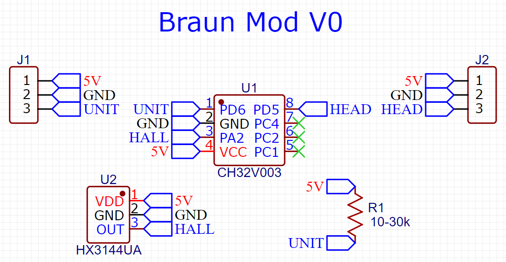
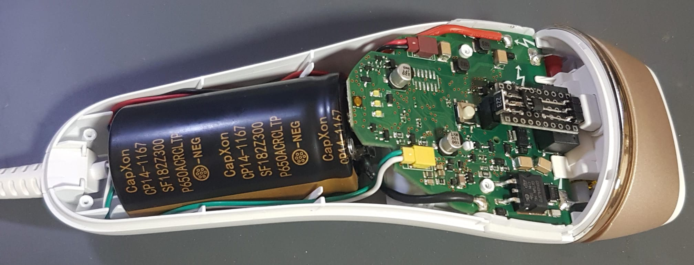
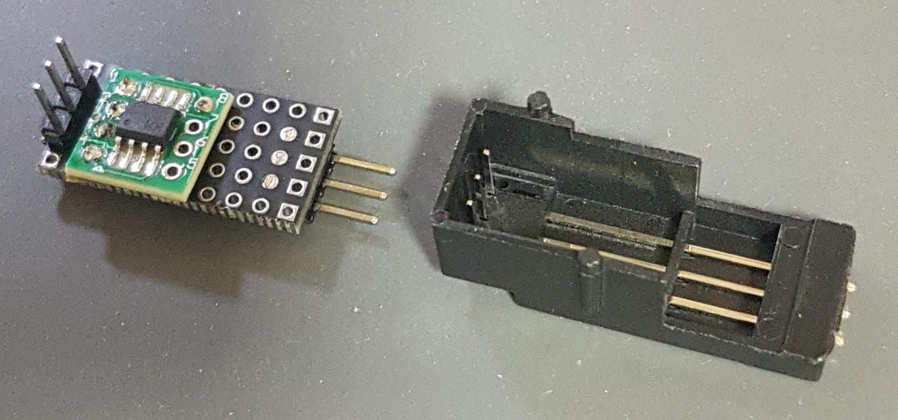
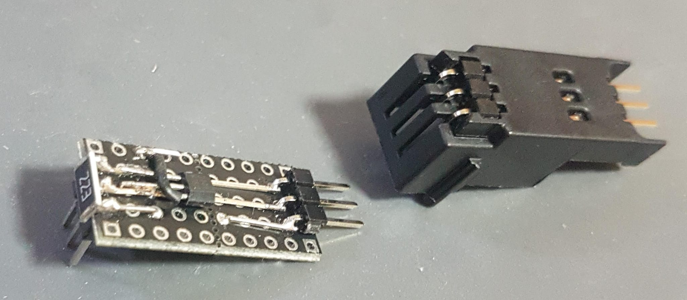

#  Braun silk expert pro mod
Change head sensor readings so the unit will emit a different IPL power,
usefull because the head sensor occasionally gives low readings resulting in non treated hairs.

# Head Communication Protocol:
## Pinout:
```
    ___________________    _____
   |                   \  \     \
   |       ___      5V  \  \ 5V  \
===|    O (___)     GND |  | GND |
   |                OD  /  / OD  /
   |___________________/  /_____/
```

* 5V only available in active mode (after pressing round power button).
* Single line bus of open-drain UART (each side is both RX and TX).
* 3.3V pullup on head side.
* UART: 9600bps 8bit no parity LSB first.



## Powerup Sequence:


##### 1. Head sends a `get_model()` packet (try 4 times, 500ms reply timeout, afterward goes to #5):
`2C,D3,00,07,25,2C,5F`
* src(`2C`) request(`D3`) get_model(`00`) + size(`07`) + dest(`25`) + fletcher16(`2C,5F`)

##### 2. Braun sends a `get_model()` reply:
`25,DA,00,14,2C,54,39,30,30,43,34,32,31,30,34,35,37,34,0E,31`
* src(`25`) response(`DA`) get_model(`00`) + size(`14`) + dest(`2c`) + `'T900C42104574'` + fletcher16(`2C,5F`)

##### 3. Head sends an `set_params()` packet (unknown params..):
`2C,D3,01,14,25,0C,D4,18,A4,C5,75,B6,51,92,00,00,00,00,AD,E2`
* src(`2C`) request(`D3`) set_params(`01`) + size(`14`) + dest(`25`) + params(..) + fletcher16(`AD,E2`)

##### 4. Braun sends an `set_params()` reply:
`25,DA,C5,08,2C,01,FA,AD`
* src(`25`) response(`DA`) set_params_ack(`C5`) + size(`08`) + dest(`2c`) + data(`01`) + fletcher16(`2C,5F`)

##### 5. Head sends a `sensor_read()` packet every 107ms:
`2C,D3,24,1A,25,#0,00,00,00,#1,00,64,64,#2,#3,0D,#4,#5,#6,#7,#8,#9,#a,#b,#c,#d`
* src(`2C`) request(`D3`) sensor_read(`24`) + size(`1A`) + dest(`25`) + params(..) + fletcher16(`#b,#c`)
###### This is a 26 bytes packet, some params are fixed, here are the known params:
`#0` = laser power - see calculation below (0=off 1..10=low to high)
`#1` = head type (02=standard, 22=small)
`#2` = `max(9, 10 - #0)`
`#3` = `#2 + 4`
`#4,#5` = left color tone (LSB,MSB higher=brighter)
`#6,#7` = right color tone (LSB,MSB higher=brighter)
`#8` = left skin proximity (0..49=non contact, jumps to 180..255=skin contact)
`#9` = right skin proximity (0..49=non contact, jumps to 180..255=skin contact)
`#a,#b` = temperature (LSB,MSB units of 0.1°C)
`#c,#d` = `fletcher16(packet[:-2])`
###### Laser power calculation:
`#0` = `0 if min(#8, #9) < 180 else max(min(#45, #67) - 4600, 0) // 600`
###### Based on threshold level rounding of sniffed packets:

| `#0` | `min(#45, #67)` | `rounding` |
| ------- | ------- | ------- |
| 01 | 4668 | 4600 |
| 02 | 5264 | 5200 |
| 03 | 5887 | 5800 |
| 04 | 6526 | 6400 |
| 05 | 7094 | 7000 |
| 06 | 7841 | 7600 |
| 07 | 8364 | 8200 |
| 08 | 8930 | 8800 |
| 09 | 9542 | 9400 |
| 10 | 10154 | 10000 |

## The mod hardware:




### Packet Test and Generate Code:
```python
def fletcher16(buff):
    sum1 = sum2 = 0
    for b in buff:
        sum1 = (sum1 + b) % 255
        sum2 = (sum2 + sum1) % 255
    return (sum2 << 8) | sum1


def test_packet_checksum():
    for p in map(bytes.fromhex, (
        '2CD30007252C5F',
        '25DA00142C543930304334323130343537340E31',
        '2CD30114250CD418A4C575B6519200000000ADE2',
        '25DAC5082C01FAAD',
        '2CD3241A250000000002006464090D0D000028000000FD007786',
        '2CD3241A250A000000220055C800040D31295128E4EC20018563',
    )):
        print('Packet:', p.hex().upper())
        print('Orig checksum:', p[-2:].hex().upper())
        print('Calc checksum:', fletcher16(p[:-2]).to_bytes(2, "little").hex().upper())
        print()


def generate_sensor_read_packets(print_c_array=False):
    from struct import pack_into

    buff = bytearray(26)
    buff_mem = memoryview(buff)

    for i in range(11):
        e = max(9, 10 - i)
        t = 4600 + 300 * i if i else 2000
        p = 220 if i else 0
        pack_into('BBBBBBBBBBBBBBBBHHBBH', buff, 0, 
            0x2C, 0xD3, 0x24, 0x1A, 0x25, i, 0, 0, 0, 0x02, 0,
            0x64, 0x64, e, e + 4, 0x0D, t, t ,p, p, 300)
        pack_into('H', buff, -2, fletcher16(buff_mem[:-2]))
        if print_c_array:
            for b in buff_mem[:13]:
                print('0x{:02X},'.format(b), end='')
            print()
            for b in buff_mem[13:]:
                print('0x{:02X},'.format(b), end='')
            print()
        else:
            print(buff.hex().upper())

test_packet_checksum()
generate_sensor_read_packets()
```

### Sniffed sensor_read() Packets:
```
Standard Idle:
2C,D3,24,1A,25,00,00,00,00,02,00,64,64,09,0D,0D,00,00,28,00,00,00,FD,00,77,86
2C,D3,24,1A,25,00,00,00,00,02,00,64,64,09,0D,0D,5B,09,60,09,00,00,FD,00,1D,1F
2C,D3,24,1A,25,00,00,00,00,02,00,64,64,09,0D,0D,5B,09,57,09,01,00,FD,00,15,EC
2C,D3,24,1A,25,00,00,00,00,02,00,64,64,09,0D,0D,60,09,60,09,01,00,FD,00,23,4B
2C,D3,24,1A,25,00,00,00,00,02,00,64,64,09,0D,0D,65,09,60,09,01,00,FD,00,28,73
2C,D3,24,1A,25,00,00,00,00,02,00,64,64,09,0D,0D,60,09,60,09,01,01,FE,00,25,50
2C,D3,24,1A,25,00,00,00,00,02,00,64,64,09,0D,0D,65,09,5C,09,01,00,FE,00,25,5D
2C,D3,24,1A,25,00,00,00,00,02,00,64,64,09,0D,0D,65,09,60,09,01,00,FE,00,29,75
2C,D3,24,1A,25,00,00,00,00,02,00,64,64,09,0D,0D,60,09,64,09,01,01,FE,00,29,68
2C,D3,24,1A,25,00,00,00,00,02,00,64,64,09,0D,0D,60,09,60,09,01,00,FE,00,24,4D
2C,D3,24,1A,25,00,00,00,00,02,00,64,64,09,0D,0D,60,09,60,09,01,01,FE,00,25,50
2C,D3,24,1A,25,00,00,00,00,02,00,64,64,09,0D,0D,65,09,60,09,01,01,FE,00,2A,78
2C,D3,24,1A,25,00,00,00,00,02,00,64,64,09,0D,0D,60,09,64,09,02,01,FE,00,2A,6C
2C,D3,24,1A,25,00,00,00,00,02,00,64,64,09,0D,0D,60,09,60,09,02,00,FE,00,25,51
2C,D3,24,1A,25,00,00,00,00,02,00,64,64,09,0D,0D,60,09,64,09,03,01,FE,00,2B,70
2C,D3,24,1A,25,00,00,00,00,02,00,64,64,09,0D,0D,60,09,64,09,03,01,FF,00,2C,72
2C,D3,24,1A,25,00,00,00,00,02,00,64,64,09,0D,0D,60,09,5C,09,03,01,FF,00,24,42
2C,D3,24,1A,25,00,00,00,00,02,00,64,64,09,0D,0D,65,09,60,09,02,01,FF,00,2C,7E
2C,D3,24,1A,25,00,00,00,00,02,00,64,64,09,0D,0D,6A,09,69,09,03,01,FF,00,3B,E0
2C,D3,24,1A,25,00,00,00,00,02,00,64,64,09,0D,0D,65,09,64,09,03,02,FF,00,32,9D
2C,D3,24,1A,25,00,00,00,00,02,00,64,64,09,0D,0D,65,09,69,09,03,02,FF,00,37,BB
2C,D3,24,1A,25,00,00,00,00,02,00,64,64,09,0D,0D,6A,09,64,09,03,02,FF,00,37,C5
2C,D3,24,1A,25,00,00,00,00,02,00,64,64,09,0D,0D,6A,09,64,09,03,02,FF,00,37,C5
2C,D3,24,1A,25,00,00,00,00,02,00,64,64,09,0D,0D,65,09,64,09,03,02,FF,00,32,9D
2C,D3,24,1A,25,00,00,00,00,02,00,64,64,09,0D,0D,6A,09,64,09,03,02,FF,00,37,C5
2C,D3,24,1A,25,00,00,00,00,02,00,64,64,09,0D,0D,6A,09,64,09,03,02,00,01,38,C6
2C,D3,24,1A,25,00,00,00,00,02,00,64,64,09,0D,0D,6A,09,60,09,03,02,00,01,34,AE
2C,D3,24,1A,25,00,00,00,00,02,00,64,64,09,0D,0D,6A,09,60,09,03,02,00,01,34,AE
2C,D3,24,1A,25,00,00,00,00,02,00,64,64,09,0D,0D,6A,09,60,09,03,02,00,01,34,AE
2C,D3,24,1A,25,00,00,00,00,02,00,64,64,09,0D,0D,6A,09,60,09,03,02,00,01,34,AE
2C,D3,24,1A,25,00,00,00,00,02,00,64,64,09,0D,0D,6A,09,60,09,03,03,00,01,35,B1
2C,D3,24,1A,25,00,00,00,00,02,00,64,64,09,0D,0D,6A,09,60,09,03,03,00,01,35,B1
2C,D3,24,1A,25,00,00,00,00,02,00,64,64,09,0D,0D,6A,09,64,09,03,03,00,01,39,C9
2C,D3,24,1A,25,00,00,00,00,02,00,64,64,09,0D,0D,60,09,60,09,03,03,00,01,2B,61
2C,D3,24,1A,25,00,00,00,00,02,00,64,64,09,0D,0D,60,09,60,09,03,03,00,01,2B,61
2C,D3,24,1A,25,00,00,00,00,02,00,64,64,09,0D,0D,60,09,60,09,03,03,01,01,2C,63
2C,D3,24,1A,25,00,00,00,00,02,00,64,64,09,0D,0D,60,09,60,09,04,04,01,01,2E,6A
2C,D3,24,1A,25,00,00,00,00,02,00,64,64,09,0D,0D,60,09,5C,09,03,04,01,01,29,4E
2C,D3,24,1A,25,00,00,00,00,02,00,64,64,09,0D,0D,60,09,60,09,04,03,01,01,2D,67
2C,D3,24,1A,25,00,00,00,00,02,00,64,64,09,0D,0D,60,09,64,09,04,04,01,01,32,82
2C,D3,24,1A,25,00,00,00,00,02,00,64,64,09,0D,0D,60,09,60,09,03,03,01,01,2C,63
2C,D3,24,1A,25,00,00,00,00,02,00,64,64,09,0D,0D,60,09,60,09,03,03,01,01,2C,63
2C,D3,24,1A,25,00,00,00,00,02,00,64,64,09,0D,0D,6A,09,60,09,04,04,01,01,38,BA
2C,D3,24,1A,25,00,00,00,00,02,00,64,64,09,0D,0D,60,09,64,09,04,03,01,01,31,7F
2C,D3,24,1A,25,00,00,00,00,02,00,64,64,09,0D,0D,6A,09,5C,09,05,04,01,01,35,A6
2C,D3,24,1A,25,00,00,00,00,02,00,64,64,09,0D,0D,6A,09,60,09,05,04,02,01,3A,C0
2C,D3,24,1A,25,00,00,00,00,02,00,64,64,09,0D,0D,6A,09,60,09,05,04,02,01,3A,C0
2C,D3,24,1A,25,00,00,00,00,02,00,64,64,09,0D,0D,60,09,60,09,04,04,02,01,2F,6C
2C,D3,24,1A,25,00,00,00,00,02,00,64,64,09,0D,0D,60,09,5C,09,04,04,02,01,2B,54
2C,D3,24,1A,25,00,00,00,00,02,00,64,64,09,0D,0D,60,09,60,09,05,03,02,01,2F,6D
2C,D3,24,1A,25,00,00,00,00,02,00,64,64,09,0D,0D,6A,09,60,09,05,05,02,01,3B,C3
2C,D3,24,1A,25,00,00,00,00,02,00,64,64,09,0D,0D,60,09,5C,09,04,04,02,01,2B,54
2C,D3,24,1A,25,00,00,00,00,02,00,64,64,09,0D,0D,60,09,60,09,05,04,02,01,30,70

Small Idle:
2C,D3,24,1A,25,00,00,00,00,22,00,55,C8,09,0D,0D,5C,09,5A,09,0C,03,E5,00,84,DE
2C,D3,24,1A,25,00,00,00,00,22,00,55,C8,09,0D,0D,60,09,66,09,0C,02,E6,00,94,46
2C,D3,24,1A,25,00,00,00,00,22,00,55,C8,09,0D,0D,60,09,5A,09,0C,03,E6,00,89,01
2C,D3,24,1A,25,00,00,00,00,22,00,55,C8,09,0D,0D,5C,09,5A,09,0D,03,E6,00,86,E4
2C,D3,24,1A,25,00,00,00,00,22,00,55,C8,09,0D,0D,5C,09,66,09,0D,03,E6,00,92,2D
2C,D3,24,1A,25,00,00,00,00,22,00,55,C8,09,0D,0D,60,09,66,09,0D,03,E6,00,96,4D
2C,D3,24,1A,25,00,00,00,00,22,00,55,C8,09,0D,0D,57,09,5A,09,0D,03,E6,00,81,BC
2C,D3,24,1A,25,00,00,00,00,22,00,55,C8,09,0D,0D,5C,09,5A,09,0C,03,E6,00,85,E0

Small 0:
2C,D3,24,1A,25,00,00,20,00,22,00,55,C8,09,0D,0D,C3,19,20,18,01,0A,26,01,2E,05
2C,D3,24,1A,25,00,00,20,00,22,00,55,C8,09,0D,0D,C3,19,20,18,01,0A,26,01,2E,05
2C,D3,24,1A,25,00,00,20,00,22,00,55,C8,09,0D,0D,C3,19,20,18,01,0A,26,01,2E,05
2C,D3,24,1A,25,00,00,20,00,22,00,55,C8,09,0D,0D,D2,19,20,18,01,0A,26,01,3D,7D
2C,D3,24,1A,25,00,00,20,00,22,00,55,C8,09,0D,0D,C8,19,20,18,01,0A,26,01,33,2D
2C,D3,24,1A,25,00,00,20,00,22,00,55,C8,09,0D,0D,C8,19,26,18,01,0A,26,01,39,51
2C,D3,24,1A,25,00,00,20,00,22,00,55,C8,09,0D,0D,C8,19,20,18,01,0A,26,01,33,2D

Small 10:
2C,D3,24,1A,25,0A,00,00,00,22,00,55,C8,00,04,0D,31,29,5D,28,E4,EC,20,01,91,AB
2C,D3,24,1A,25,0A,00,00,00,22,00,55,C8,00,04,0D,2C,29,5D,28,E4,EC,20,01,8C,83
2C,D3,24,1A,25,0A,00,00,00,22,00,55,C8,00,04,0D,31,29,51,28,E4,EC,20,01,85,63
2C,D3,24,1A,25,0A,00,00,00,22,00,55,C8,00,04,0D,31,29,5D,28,E4,EC,20,01,91,AB
2C,D3,24,1A,25,0A,00,00,00,22,00,55,C8,00,04,0D,31,29,5D,28,E4,EC,20,01,91,AB
2C,D3,24,1A,25,0A,00,00,00,22,00,55,C8,00,04,0D,2C,29,5D,28,E4,EC,20,01,8C,83
2C,D3,24,1A,25,0A,00,00,00,22,00,55,C8,00,04,0D,2C,29,51,28,E4,EB,20,01,7F,38
2C,D3,24,1A,25,0A,00,00,00,22,00,55,C8,00,04,0D,27,29,4A,28,E4,EB,20,01,73,E5

Standard 1:
2C,D3,24,1A,25,06,00,00,00,02,00,64,64,04,08,0D,3D,20,7B,26,E2,B4,1C,01,01,F3
2C,D3,24,1A,25,06,00,00,00,02,00,64,64,04,08,0D,3D,20,85,26,E2,B3,1C,01,0A,2D
2C,D3,24,1A,25,06,00,00,00,02,00,64,64,04,08,0D,32,20,94,26,E2,B3,1C,01,0E,2F
2C,D3,24,1A,25,06,00,00,00,02,00,64,64,04,08,0D,22,20,63,26,E2,B4,1C,01,CD,8A
2C,D3,24,1A,25,06,00,00,00,02,00,64,64,04,08,0D,1C,20,46,26,E2,B3,1C,01,A9,A8
2C,D3,24,1A,25,06,00,00,00,02,00,64,64,04,08,0D,01,20,24,26,E2,B4,1C,01,6D,06
2C,D3,24,1A,25,06,00,00,00,02,00,64,64,04,08,0D,FC,1F,06,26,E2,B3,1C,01,49,27
2C,D3,24,1A,25,06,00,00,00,02,00,64,64,04,08,0D,01,20,F8,25,E2,B3,1C,01,40,FA

Standard 4:
2C,D3,24,1A,25,04,00,00,00,02,00,64,64,06,0A,0D,32,20,D3,1A,E0,DD,0B,01,5A,C6
2C,D3,24,1A,25,04,00,00,00,02,00,64,64,06,0A,0D,2D,20,AC,1A,E0,DD,0B,01,2E,B3
2C,D3,24,1A,25,04,00,00,00,02,00,64,64,06,0A,0D,27,20,D3,1A,E0,DD,0B,01,4F,6E
2C,D3,24,1A,25,04,00,00,00,02,00,64,64,06,0A,0D,27,20,D3,1A,E0,DD,0B,01,4F,6E
2C,D3,24,1A,25,04,00,00,00,02,00,64,64,06,0A,0D,22,20,C4,1A,E0,DE,0B,01,3C,EE
2C,D3,24,1A,25,04,00,00,00,02,00,64,64,06,0A,0D,22,20,AC,1A,E0,DD,0B,01,23,5B
2C,D3,24,1A,25,04,00,00,00,02,00,64,64,06,0A,0D,22,20,C9,1A,E0,DE,0B,01,41,0D
2C,D3,24,1A,25,04,00,00,00,02,00,64,64,06,0A,0D,1C,20,04,1B,E0,DD,0C,01,76,3E
2C,D3,24,1A,25,04,00,00,00,02,00,64,64,06,0A,0D,17,20,EB,1A,E0,DE,0B,01,58,81
2C,D3,24,1A,25,04,00,00,00,02,00,64,64,06,0A,0D,12,20,0D,1B,E0,DD,0C,01,75,24

Standard 10:
2C,D3,24,1A,25,0A,00,00,00,02,00,64,64,00,04,0D,1A,29,41,2A,DE,85,5B,01,B8,A9
2C,D3,24,1A,25,0A,00,00,00,02,00,64,64,00,04,0D,14,29,41,2A,DE,86,5B,01,B3,7C
2C,D3,24,1A,25,0A,00,00,00,02,00,64,64,00,04,0D,14,29,41,2A,DF,86,5B,01,B4,80
2C,D3,24,1A,25,0A,00,00,00,02,00,64,64,00,04,0D,0F,29,3C,2A,DE,86,5B,01,A9,36
2C,D3,24,1A,25,0A,00,00,00,02,00,64,64,00,04,0D,09,29,32,2A,DE,85,5B,01,98,C6
2C,D3,24,1A,25,0A,00,00,00,02,00,64,64,00,04,0D,04,29,2E,2A,DE,85,5B,01,8F,86
2C,D3,24,1A,25,0A,00,00,00,02,00,64,64,00,04,0D,EE,28,29,2A,DE,86,5B,01,75,BB
2C,D3,24,1A,25,0A,00,00,00,02,00,64,64,00,04,0D,E9,28,24,2A,DE,86,5B,01,6B,75
2C,D3,24,1A,25,0A,00,00,00,02,00,64,64,00,04,0D,E4,28,1A,2A,DE,86,5C,01,5D,13

Red Error:
2C,D3,24,1A,25,00,00,20,00,02,00,64,64,09,0D,0D,87,1A,E2,26,99,93,13,01,5D,07
```

##### https://github.com/arduino12/braun-silk-expert-pro-mod
